ZHDemo
=====

~~AppleDelegate类中有几个未使用的ViewController类，分别对应几个不同的view~~
---

7/13:初步完成第一个界面设计

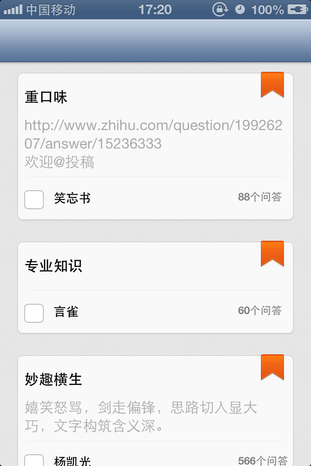

7/15:完成问答页面的headerview

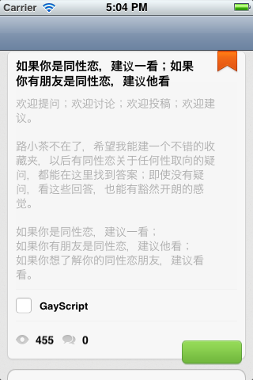

异步下载用户头像

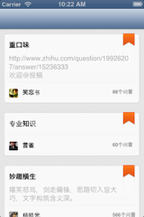

初步完成回答页面cell布局设计

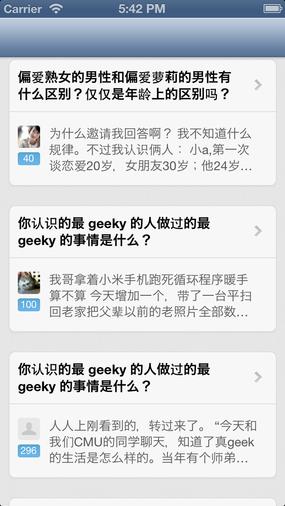

用户资料页面headerview
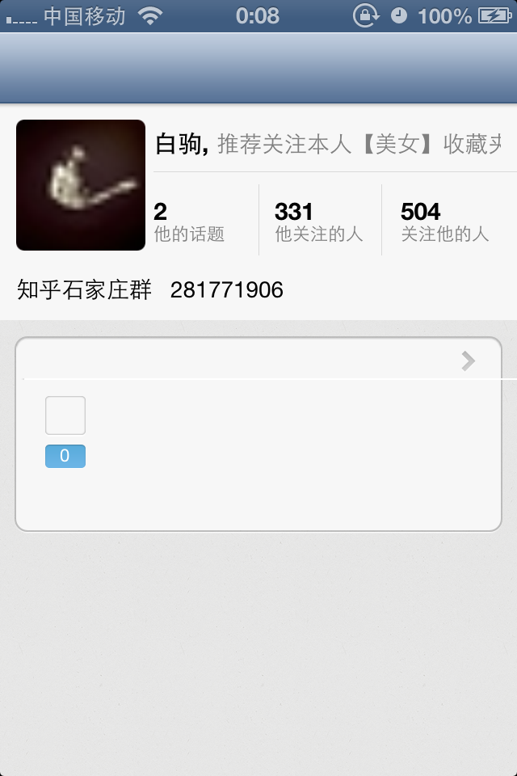

修改img2的bug
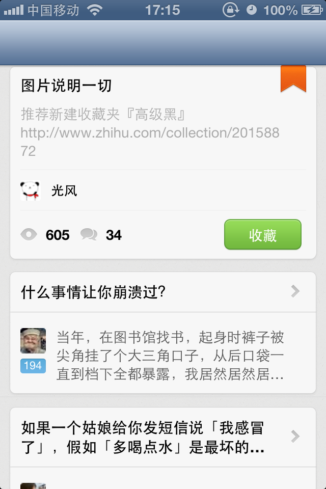

修改img5的bug

修改img7中关注按钮不响应点击的bug
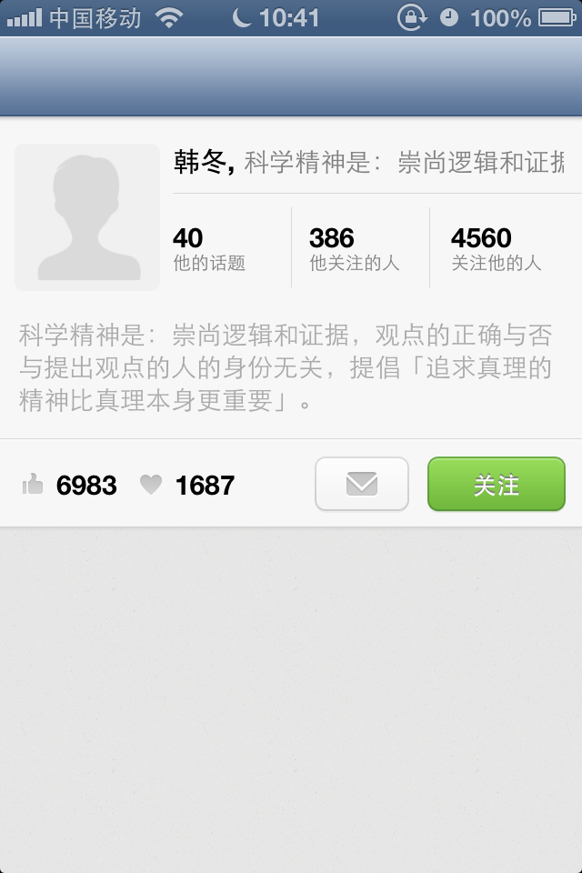

最后一个界面大体完工
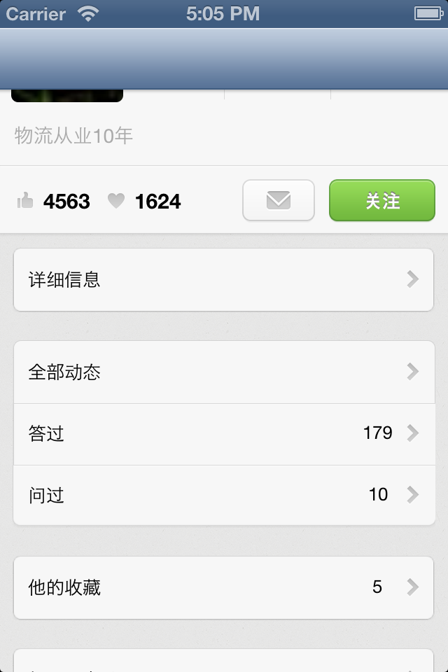

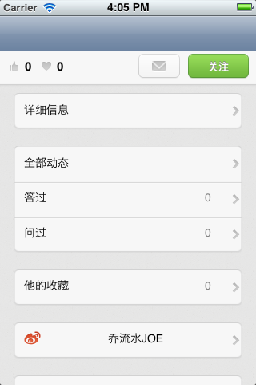

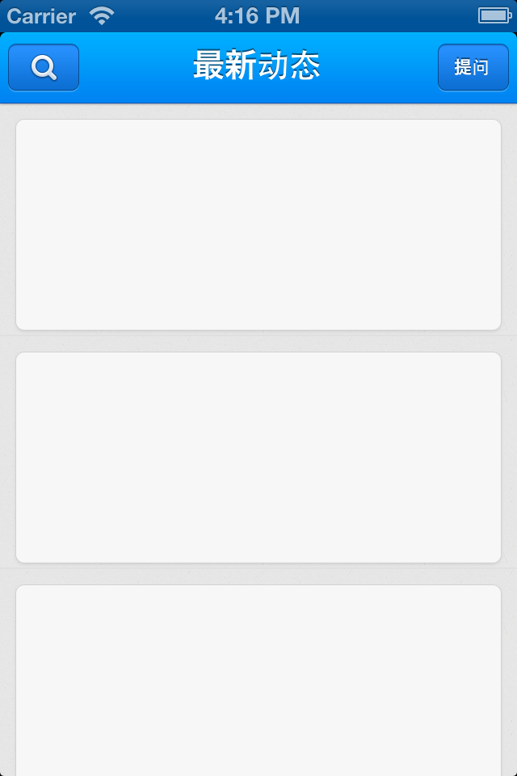

增加了最新动态界面

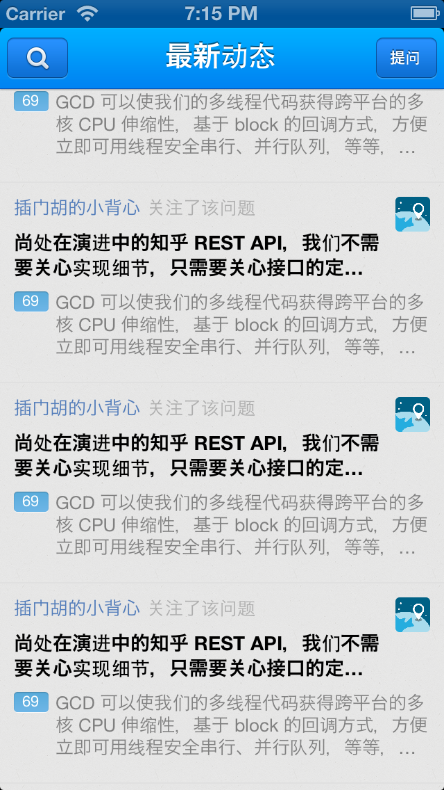

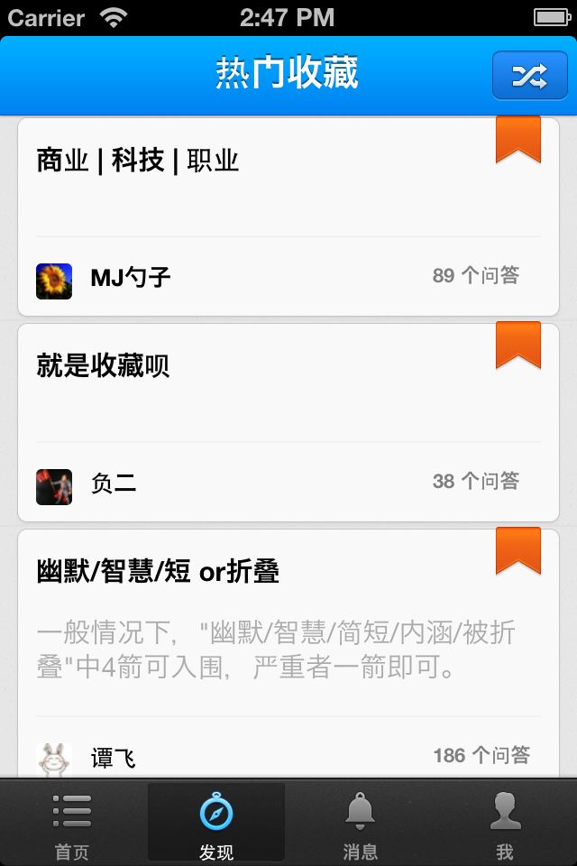

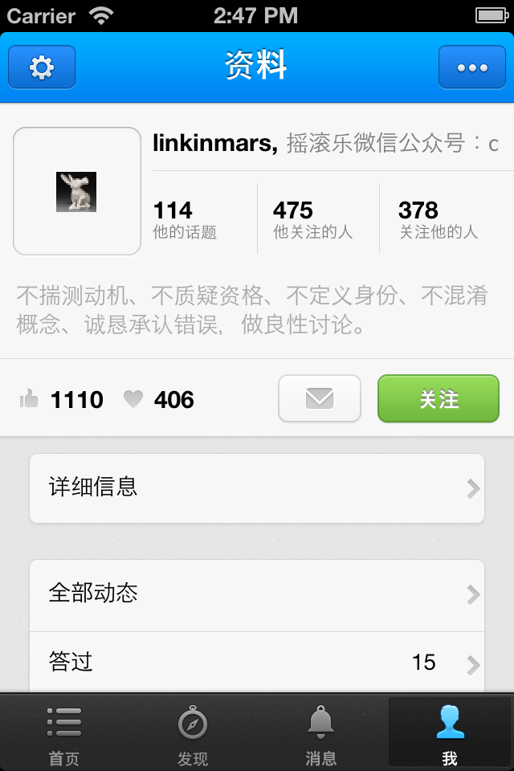

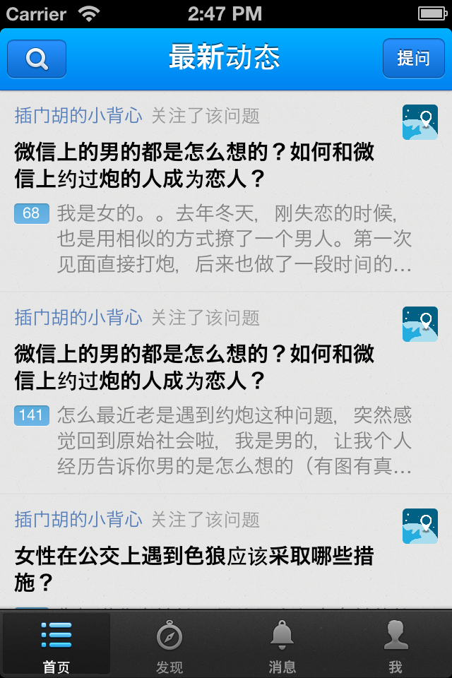